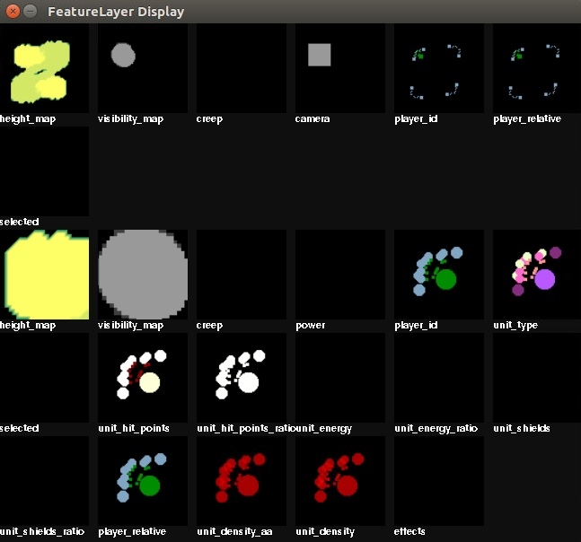
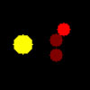
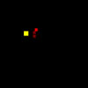
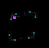

# Feature Layer



환경에서 사용하는 Feature Layer들을 설명합니다.  

Feature Layer는 게임 좌측하단의 미니맵, 게임화면(카메라가 보고 있는 곳)을 보여주는 2종류로 크게 구성되어 있으며, 상세한 항목은 다음과 같습니다.

## Blizzard 제공

Blizzard가 제공하는 Feature Layer의 경우 다음 링크를 참고하세요. [pysc2](https://github.com/deepmind/pysc2/blob/master/docs/environment.md#feature-layers)

Blizzard에서 제공하는 소스데이터는 모두 1채널 값인 Scalar이며, RGB로 변환된 데이터는 3채널 데이터 입니다.


### Minimap

값 | 소스 | 전처리
---|:---:|:---:|
`height_map` | 0, 255(Continuous) | Continuous, Green
`visibility_map` | 0, 3(Discrete) | Discrete, Gray
`creep` | 0, 1(Discrete)  | Discrete, Purple
`camera` | 0, 1(Discrete) | Discrete, Gray
`player_id` | 1, 16(Discrete) | Discrete, Rulebased
`player_relative` | 1, 4(Discrete) | Discrete, Rulebased
`selected` | 0, 1(Discrete) | Discrete, Gray

### Screen

값 | 소스 | 전처리
---|:---:|:---:|
`height_map` | 0, 255(Continuous) | Continuous, Green
`visibility_map` | 0, 3(Discrete) | Discrete, Gray
`creep` | 0, 1(Discrete) | Discrete, Purple
`power` | 0, 1(Discrete) | Discrete, Cyan
`player_id` | 1, 16(Discrete) | Discrete, Rulebased
`player_relative` | 1, 4(Discrete) | Discrete, Rulebased
`unit_type` | 0, inf(Discrete) | Discrete, Rulebased
`selected` | 0, 1(Discrete) | Discrete, Gray
`unit_hit_points` | 0, 255(Continuous)  | Continuous, Red
`unit_hit_points_ratio` | 0, 255(Continuous)  | Continuous, Red
`unit_energy` | 0, 255(Continuous) | Continuous, Red
`unit_energy_ratio` | 0, 255(Continuous) | Continuous, Red
`unit_shields` | 0, 255(Continuous) | Discrete, Red
`unit_shields_ratio` | 0, 255(Continuous) | Discrete, Red
`unit_density` | 0, 16(Continuous) | Continuous, Red
`unit_density_aa` | 0, 255(Continuous) | Continuous, Red
`effects` | 0, 255(Discrete) | Discrete, Rulebased

## Customized

값 | 설명 | 소스 | 전처리 | 예시(screen) | 예시(minimap)
---|:---:|:---:|:---:|:---:|:---:|
`structure_busy` | 생성중인 건물을 바쁨 정도에 따라 구분(생산큐) | 0, 5(Continuous) | Continuous, Red |  | 
`unit_type(minimap)` | 미니맵에서 UnitType의 분포를 나타냄 (Blizzard가 제공하는 것과 값, 색이 같음) | 0, inf(Discrete) | Discrete, Rulebased | N/A | 

## Usage
Agent 클래스의 `feature_layer`에서 dictionary 형태로 접근합니다.  
접근시 PixelMapFeature Object가 반환되며, `numpy`나 `rgb` 속성을 통해 원하는 데이터를 가져올 수 있습니다.

```python
# (Agent.class)
   
async def on_step(self, iteration):
   self.state.feature_layer['screen']['unit_type'].numpy         # 1채널 데이터
   self.state.feature_layer['screen']['unit_type'].rgb           # 3채널 데이터 (height, width, 3)

   self.state.feature_layer['minimap']['player_relative'].numpy  # 1채널 데이터
   self.state.feature_layer['minimap']['player_relative'].rgb    # 3채널 데이터 (height, width, 3)
```
각 Agent별 FeatureLayer Display는 Agent클래스 생성자에서 `is_render(bool)`로 선택할 수 있습니다.
```python
   sc2.run_game(sc2.map.get("Simple64"), [
      Bot(Race.Protoss, Agent(is_render=(True|False)),
      Computer(Race.Protoss, Difficulty.Easy)
   ],
      ....
```
